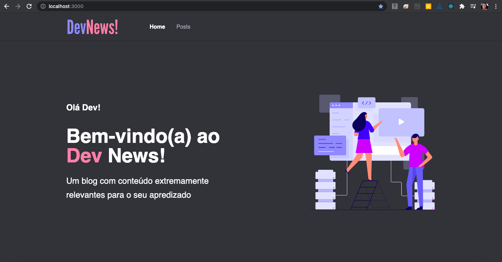

<h1 align="center">
  
</h1>

  

 

  

## ✨ Tecnologias

Esse projeto foi desenvolvido com as seguintes tecnologias:

- [Next.js](https://nextjs.org/)
- [Prismic CMS](https://prismic.io/)
- [TypeScript](https://www.typescriptlang.org/)

## 💻 Projeto

O devnews é um aplicativo de blog que acessar informações cadastradas no Prismic CMS.

## 🔖 Preview

Você pode visualizar o layout do projeto através [desse link]()

## 🚀 Como executar

- Clone o repositório
- Instale as dependências com `yarn`
- Inicie com `yarn dev`

Agora você pode acessar [`localhost:3000`](http://localhost:3000) do seu navegador.

## 📄 Licença

Esse projeto está sob a licença MIT. Veja o arquivo [LICENSE](LICENSE.md) para mais detalhes.

---

Feito com ♥ by Yuri Brasil 👋🏻
